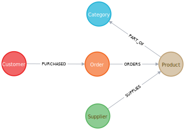

= Neo4j Java Driver - Object Mapping

This is a repository to test out the https://github.com/neo4j/neo4j-java-driver/discussions/1640[preview feature of the Neo4j Java Driver
for object mapping^]. The goal is to provide a simple way to map Java objects to Neo4j nodes and relationships, and vice versa.

The object mapping feature is currently in preview and is not yet part of the official Neo4j Java Driver release, so it includes the caveats outlined on the https://github.com/neo4j/neo4j-java-driver/blob/5.0/README.md#preview-features[Java driver repo for preview features^].

== Data set

Uses the Northwind graph data set from the https://github.com/neo4j-graph-examples/northwind[Northwind graph examples^] repository. The data set is a e-commerce data set that includes information about customers, orders, and products.

== Run

[source, bash]
----
./mvnw compile exec:java -Dexec.mainClass="com.neo4j.app.App"
----